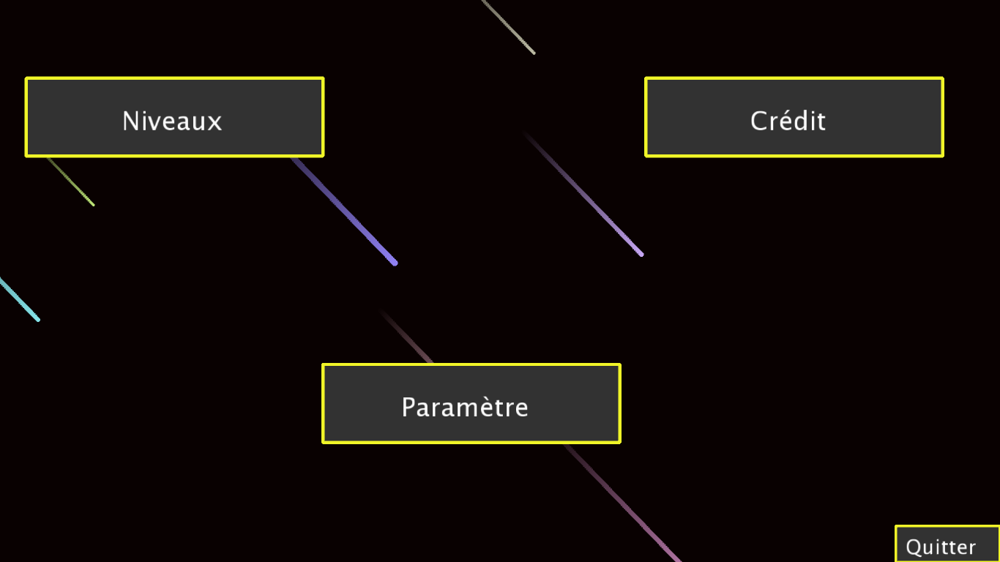
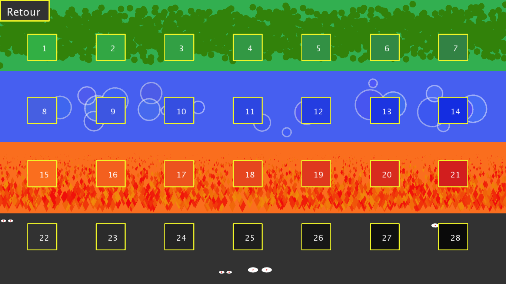
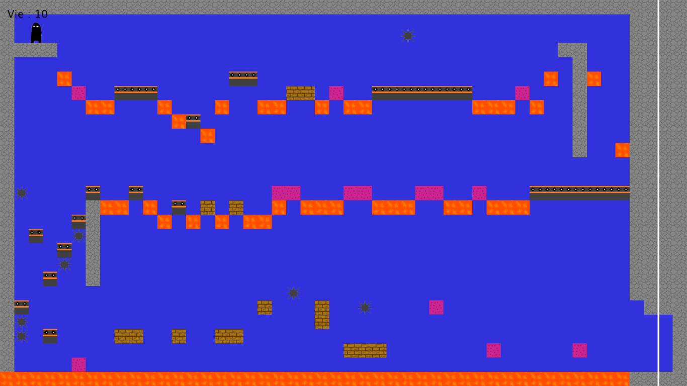

# Clone_Mario

## Principe :
Jeux de platforme 2D, integrant aussi un générateur de carte

Projet initial datant de 2018

## Visuel :

Menu principal :

Menu de selection des niveaux :

Jeux :

## Comment l'ouvrir et le lancer :
-Télécharger Processing 3 : https://processing.org/download/

-Ouvrir et lancer "NM-9/NihoManide/NihoManide.pde" avec Processing 3
